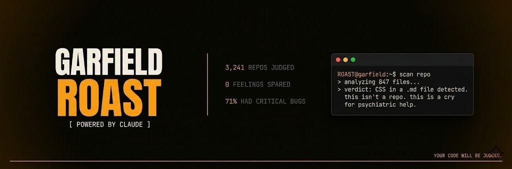
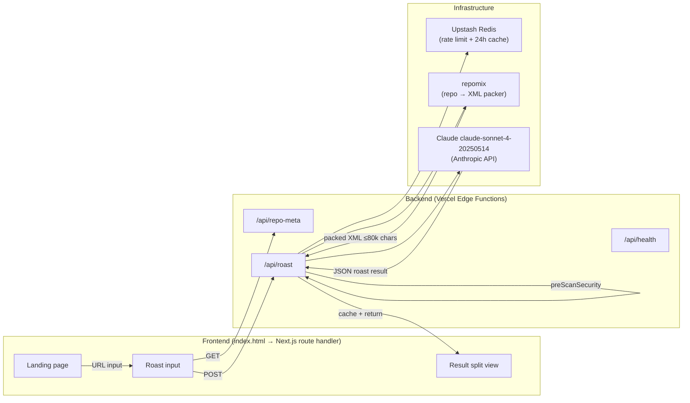
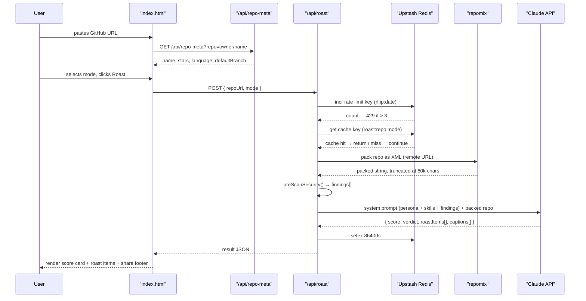
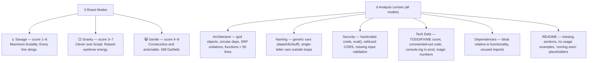

# Garfield Roast

<p align="center">
  
</p>

**Paste a GitHub repo URL. Garfield reads every file and roasts your code — specifically and mercilessly.**


<a href="https://github.com/caesarzach/garfield-roast" aria-label="GitHub"><svg xmlns="http://www.w3.org/2000/svg" width="24" height="24" viewBox="0 0 24 24" fill="currentColor"><path d="M12 2C6.477 2 2 6.484 2 12.017c0 4.425 2.865 8.18 6.839 9.504.5.092.682-.217.682-.483 0-.237-.008-.868-.013-1.703-2.782.605-3.369-1.343-3.369-1.343-.454-1.158-1.11-1.466-1.11-1.466-.908-.62.069-.608.069-.608 1.003.07 1.531 1.032 1.531 1.032.892 1.53 2.341 1.088 2.91.832.092-.647.35-1.088.636-1.338-2.22-.253-4.555-1.113-4.555-4.951 0-1.093.39-1.988 1.029-2.688-.103-.253-.446-1.272.098-2.65 0 0 .84-.27 2.75 1.026A9.564 9.564 0 0 1 12 6.844a9.59 9.59 0 0 1 2.504.337c1.909-1.296 2.747-1.027 2.747-1.027.546 1.379.202 2.398.1 2.651.64.7 1.028 1.595 1.028 2.688 0 3.848-2.339 4.695-4.566 4.943.359.309.678.92.678 1.855 0 1.338-.012 2.419-.012 2.747 0 .268.18.58.688.482A10.02 10.02 0 0 0 22 12.017C22 6.484 17.522 2 12 2z"/></svg></a>

Garfield Roast is a Next.js 14 application that packs a GitHub repository using repomix, runs a security pre-scan, then feeds the result to Claude for a scored, file-level code roast. Three modes — Savage, Snarky, Gentle — adjust tone and score range. Results are cached 24 hours per repo+mode combination and shareable as a screenshot card posted directly to X.

---

## What it does

- **Roast** — paste any public GitHub URL, pick a mode, receive a score (1–10), a one-sentence verdict, and 4–8 file-level roast items with severity ratings (critical / warning / note)
- **Security scan** — a regex pre-scan detects committed secrets (AWS keys, OpenAI keys, hardcoded passwords, private keys) before the Claude call; findings are injected into the prompt to make them hit extra hard
- **Share** — html2canvas captures the result panel as a PNG; one click posts to X with a pre-filled caption chosen from three Claude-generated options

---

## Key features

| Feature | Description |
|---|---|
| 3 roast modes | Savage (score 1–6), Snarky (3–7), Gentle (4–8) — each a distinct Garfield persona with its own brutality level |
| File-level roast items | 4–8 items per roast, each linked to a specific filename from the actual repo |
| Security pre-scan | Regex detection of AWS keys, OpenAI keys, hardcoded passwords, private keys — injected as extra roast fuel |
| 24h caching | Upstash Redis caches results per `repo:mode` key — identical requests return instantly at zero Claude cost |
| Rate limiting | 3 roasts/day per IP (server-side Redis) with localStorage soft guard as fallback |
| Share to X | html2canvas screenshot of the result panel + Twitter intent URL pre-filled with one of 3 generated captions |

---

## Live demo

```
https://garfieldroast.site
```

Paste any public GitHub repo URL in `owner/repo` format. Select a roast mode. Watch Garfield read every file and pass judgement with a score, a verdict, and per-file commentary.

---

## Architecture overview



---

## Data flow



---

## Roast modes



---

## Tech stack

| Layer | Technology |
|---|---|
| Frontend framework | Next.js 14 (App Router) |
| Language | TypeScript 5 |
| Styling | Vanilla CSS — all styles live in `index.html`, no Tailwind |
| Font | JetBrains Mono via Google Fonts CDN |
| Repo packing | repomix ^0.3.0 (remote URL → XML string) |
| AI | OpenRouter API (openai ^4.98.0) → deepseek/deepseek-chat |
| Caching + rate limit | Upstash Redis ^1.34.0 (serverless, free tier) |
| Screenshot | html2canvas 1.4.1 (CDN, loaded in index.html) |
| Deploy | Vercel (Edge Functions, `maxDuration: 60`) |
| Package manager | npm |

---

## Installation

```bash
# 1. Clone the repository
git clone https://github.com/caesarzach/garfield-roast.git
cd garfield-roast

# 2. Install dependencies (repomix, Anthropic SDK, and Upstash Redis are all required)
npm install

# 3. Copy and fill in environment variables
cp .env.example .env.local
# Edit .env.local — see Environment section below

# 4. Start development server
npm run dev
```

The development server starts at `http://localhost:3000`. Upstash Redis is required for rate limiting and caching. To test locally without Redis, comment out the rate limiting block in `app/api/roast/route.ts` (marked `/* ── 1. Rate limiting ──`).

---

## Environment

| Variable | Purpose |
|---|---|
| `ANTHROPIC_API_KEY` | Required — Claude API access (`sk-ant-...`) |
| `UPSTASH_REDIS_REST_URL` | Required — rate limiting and 24h result caching |
| `UPSTASH_REDIS_REST_TOKEN` | Required — Upstash REST auth token |
| `GITHUB_TOKEN` | Optional — raises GitHub API from 60 to 5000 req/hour |

Copy `.env.example` to `.env.local` to get started. Get Upstash credentials at upstash.com → Create Database → REST API tab. Free tier supports ~2,500 roasts/day (10k Redis commands/day ÷ ~4 commands per roast).

---

## Project structure

```
garfield-roast/
├── index.html                   # All UI, CSS, and JS — frontend source of truth (1420 lines)
├── DEVELOPER_HANDOFF.md         # Backend blueprint: repomix config, full TypeScript, viral roadmap
├── CLAUDE.md                    # Architecture decisions, API contract, connection points
│
├── app/
│   ├── route.ts                 # GET handler — serves index.html as raw HTML response
│   ├── layout.tsx
│   └── api/
│       ├── roast/
│       │   └── route.ts         # POST: rate limit → repomix → preScanSecurity → Claude → cache
│       ├── repo-meta/
│       │   └── route.ts         # GET: GitHub proxy — returns name, stars, language, branch
│       └── health/
│           └── route.ts         # GET: { status: 'ok' }
│
├── .env.example
├── next.config.ts
└── package.json
```

---

## Contributing

1. Fork the repository and create a feature branch from `dev`
2. Follow conventional commit format: `feat:`, `fix:`, `docs:`, `refactor:`, `chore:`
3. Frontend changes go in `index.html` only — match the dark terminal aesthetic, JetBrains Mono font, and `#EA8C1E` orange accent exactly
4. Open a pull request against `dev` — not `main`

See [DEVELOPER_HANDOFF.md](./DEVELOPER_HANDOFF.md) for backend architecture and the viral features roadmap (leaderboard, roast battle, streaming, token integration).

## License

MIT — see [LICENSE](./LICENSE)
